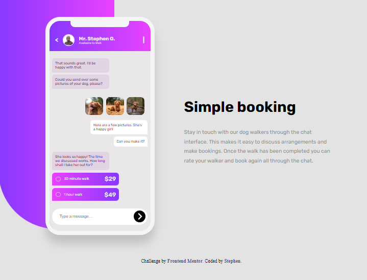
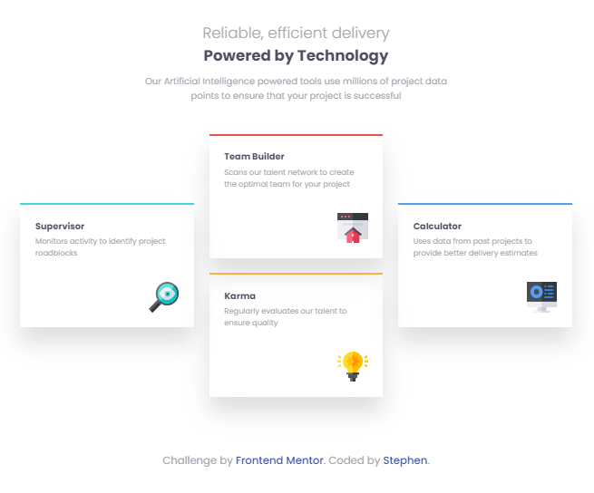
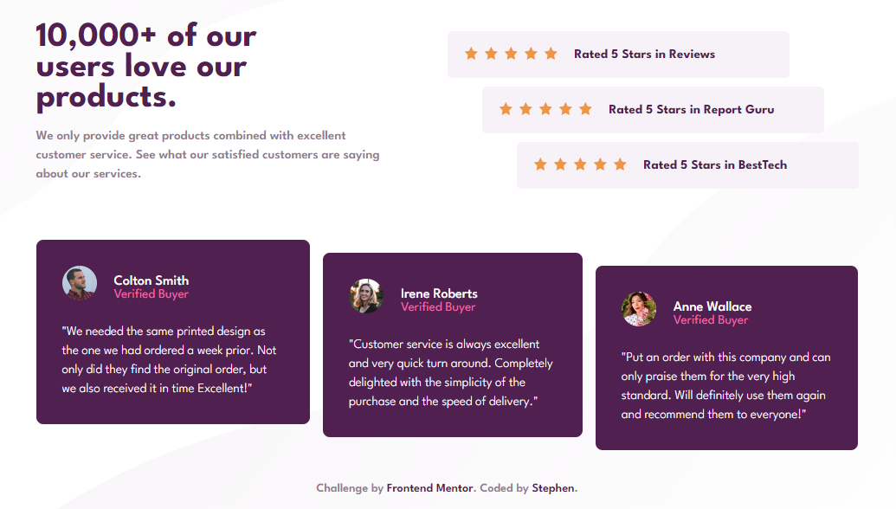
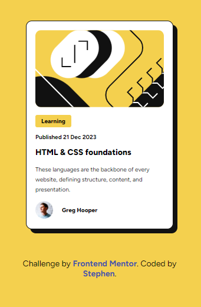
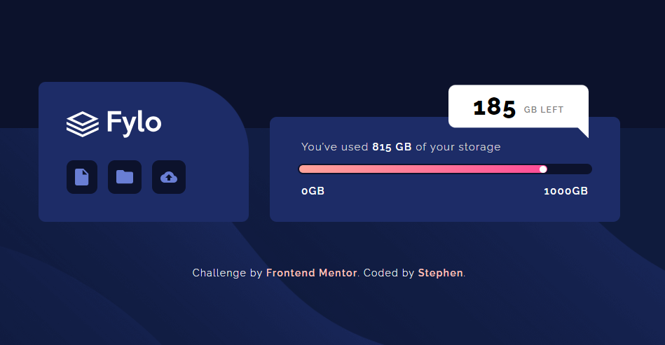
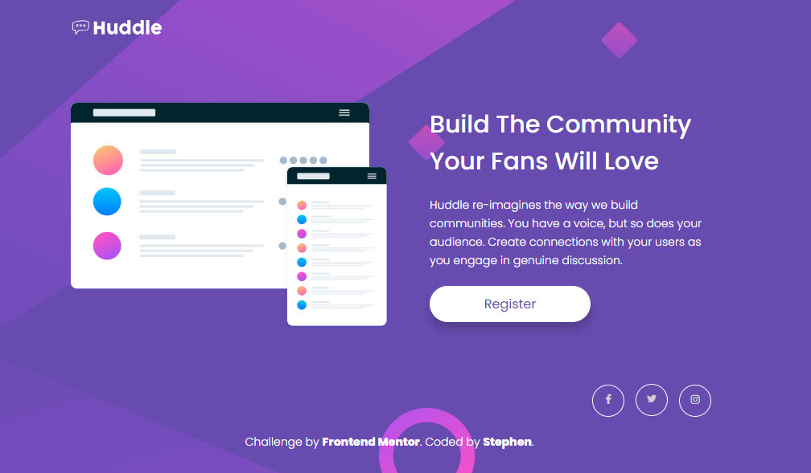

## Welcome! 👋

Thanks for checking out my front-end coding challenge. This repository contains some of the tasks I have completed on frontendmentor.io

## Table of contents

- [Projects](#overview)
  - [QR Code Component](#qr-code-component)
  - [Recipe Page](#recipe-page)
  - [Testimonial](#testimonial)
  - [Social](#social)
  - [Result](#result)
  - [Product](#product)
  - [NFT](#nft)
  - [Order Summary](#order-summary)
  - [Stats](#stats)
  - [Coulums](#columns)
  - [Profile Card](#profile-card)
  - [Chat App](#chat-app)
  - [Four Card](#four-card)
  - [Single Price](#single-price)
  - [Social Proof](#social-proof)
  - [Blog Card](#blog-card)
  - [Fylo data storage component](#Fylo-data-storage-component)
  - [Huddle landing page](#Huddle-landing-page)
  - [Huddle LP with alt ft blocks](#Huddle-LP-with-alt-ft-blocks)
  - [Clipboard Landing Page](#clipboard-landing-page)
  - [Fylo Landing Page with two column layout](#fylo-landing-page)
- [Author](#author)

### QR Code Component

- Live Site: [QR Code Component](https://xaintobas.github.io/fmc/qr-code/)

### Recipe Page

- Live Site: [Recipe Page](https://xaintobas.github.io/fmc/recipe-page/)

### Testimonial

- Live Site: [Testimonial](https://xaintobas.github.io/fmc/testimonial/)

### Social

- Live Site: [Social](https://xaintobas.github.io/fmc/social/)

### Result

- Live Site: [Result](https://xaintobas.github.io/fmc/result/)

### Product

- Live Site: [Product](https://xaintobas.github.io/fmc/product/)

### NFT

- Live Site: [NFT](https://xaintobas.github.io/fmc/nft/)

### Order Summary

- Live Site: [Order Summary](https://xaintobas.github.io/fmc/order-sum/)

### Stats

- Live Site: [Stats](https://xaintobas.github.io/fmc/stats/)

### Columns

- Live Site: [Columns](https://xaintobas.github.io/fmc/column/)

### Profile Card

- Live Site: [Profile Card](https://xaintobas.github.io/fmc/profile-card/)

### Chat App

- Live Site: [Chat App](https://xaintobas.github.io/fmc/chat-app/)

### Four Card

- Live Site: [Four Card](https://xaintobas.github.io/fmc/four-card/)

### Single Price

- Live Site: [Single Price](https://xaintobas.github.io/fmc/single-price/)

### Social Proof

- Live Site: [Social Proof](https://xaintobas.github.io/fmc/social-proof/)

### Blog Card

- Live Site: [Blog Card](https://xaintobas.github.io/fmc/blog-card/)

### Fylo data storage component

- Live Site: [Fylo data storage component](https://xaintobas.github.io/fmc/fylo/)

### Huddle landing page

- Live Site: [Huddle landing page](https://xaintobas.github.io/fmc/huddle-lp/)

### Huddle LP with alt ft blocks

- Live Site: [Huddle LP with alt ft blocks](https://xaintobas.github.io/fmc/huddle-lpg/)

### Clipboard Landing Page

- Live Site: [Clipboard Landing Page](https://xaintobas.github.io/fmc/clipboard-lp/)

### Fylo Landing Page

- Live Site: [Fylo Landing Page with two column layout](https://xaintobas.github.io/fmc/fylo-lp/)

## Author

- GitHub - [https://github.com/xaintobas](https://xaintobas.github.io/qrcode/)
- Frontend Mentor - [https://www.frontendmentor.io/profile/xaintobas](https://www.frontendmentor.io/profile/xaintobas)
- x.com - [https://x.com/xaint_obas](https://x.com/xaint_obas)
