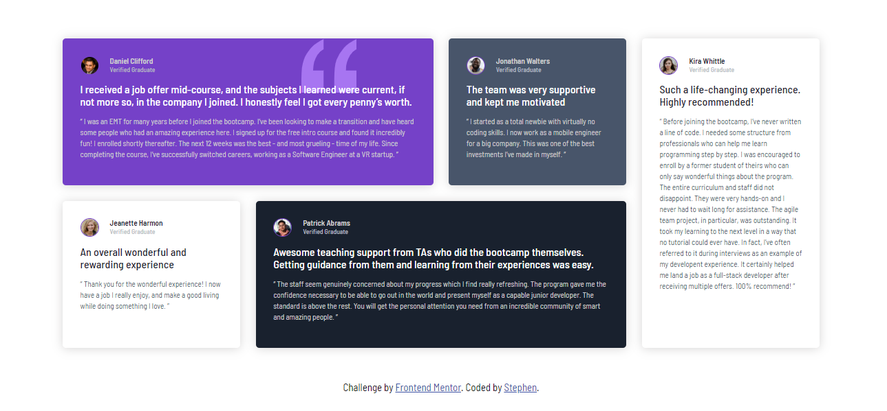

## Welcome! 👋

Thanks for checking out my front-end coding challenge. This repository contains some of the tasks I have completed on frontendmentor.io

## Table of contents

- [Projects](#overview)
  - [QR Code Component](#qr-code-component)
  - [Recipe Page](#recipe-page)
  - [Testimonial](#testimonial)
  - [Social](#social)
  - [Result](#result)
  - [Product](#product)
  - [NFT](#nft)
  - [Order Summary](#order-summary)
  - [Stats](#stats)
  - [Coulums](#columns)
  - [Profile Card](#profile-card)
  - [Chat App](#chat-app)
  - [Four Card](#four-card)
  - [Profile Card](#profile-card)
  - [Profile Card](#profile-card)
- [Author](#author)

### QR Code Component

- Live Site: [QR Code Component](https://xaintobas.github.io/fmc/qr-code/)

### Recipe Page

- Live Site: [Recipe Page](https://xaintobas.github.io/fmc/recipe-page/)

### Testimonial

- Live Site: [Testimonial](https://xaintobas.github.io/fmc/testimonial/)

### Social

- Live Site: [Social](https://xaintobas.github.io/fmc/social/)

### Result

- Live Site: [Result](https://xaintobas.github.io/fmc/result/)

### Product

- Live Site: [Product](https://xaintobas.github.io/fmc/product/)

### NFT

- Live Site: [NFT](https://xaintobas.github.io/fmc/nft/)

### Order Summary

- Live Site: [Order Summary](https://xaintobas.github.io/fmc/order-sum/)

### Stats

- Live Site: [Stats](https://xaintobas.github.io/fmc/stats/)

### Columns

- Live Site: [Columns](https://xaintobas.github.io/fmc/column/)

### Profile Card

- Live Site: [Profile Card](https://xaintobas.github.io/fmc/profile-card/)

## Author

- GitHub - [https://github.com/xaintobas](https://xaintobas.github.io/qrcode/)
- Frontend Mentor - [https://www.frontendmentor.io/profile/xaintobas](https://www.frontendmentor.io/profile/xaintobas)
- x.com - [https://x.com/xaint_obas](https://x.com/xaint_obas)
