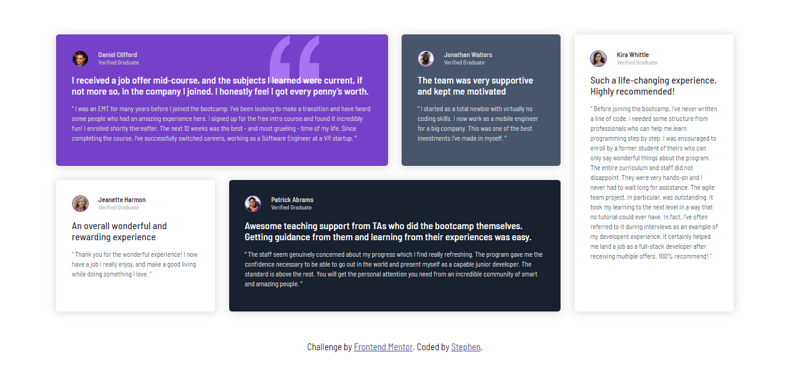

This is my solution to the Testimonials grid challenge on Frontend Mentor. Frontend Mentor challenges help you improve your coding skills by building realistic projects.

### Built with

- Semantic HTML5 markup
- CSS custom properties
- Flexbox
- CSS Grid
- Mobile-first workflow

### What I learned

During this project, I enhanced my understanding of CSS Grid and Flexbox. I learned how to effectively create responsive layouts that adapt to various screen sizes. Additionally, I improved my skills in writing clean and maintainable CSS.

To see how you can add code snippets, see below:

```css
.container {
  display: grid;
  grid-template-columns: 1fr 1fr;
  gap: 20px;
}
```

### Continued development

In future projects, I plan to continue improving my CSS Grid and Flexbox skills. I also aim to explore more advanced CSS techniques and animations to enhance user experience. Additionally, I would like to dive deeper into JavaScript to add interactivity to my projects.

## Author

- GitHub - https://github.com/xaintobas
- Frontend Mentor - https://www.frontendmentor.io/profile/xaintobas
- Twitter - https://x.com/xaint_obas
